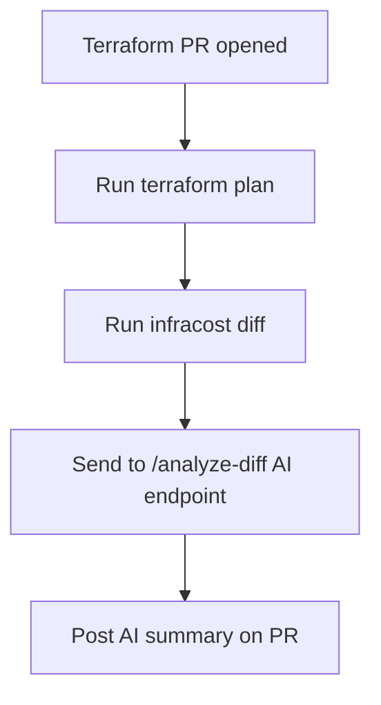

# ☁️ Terraform Cost Estimator with AI

Predict your cloud costs *before* deployment — using Terraform, Infracost, and AI.  
Now with an AI wizard, sidebar copilot, and GitHub PR comments!

---

## ✨ What This Does

- Upload your Terraform project (ZIP or plan file)
- An AI assistant scans and asks smart questions (e.g., "How often is Lambda triggered?")
- You get **editable cost estimates**
- GitHub PRs show **AI-powered cost summaries**
- Chat with the Copilot about costs anytime

---

## 🚀 Quickstart (Local Demo)

```bash
# Terminal 1: Start the backend
cd backend
cp .env.example .env  # Add your Gemini API key
pip install -r requirements.txt
uvicorn app.main:app --reload
```

```bash
# Terminal 2: Start the frontend
cd frontend
cp .env.example .env  # Point to http://localhost:8000
npm install
npm run dev
```

Then open your browser to: [http://localhost:5173](http://localhost:5173)

---

## 🧠 Features

### 🔮 AI Usage Wizard
- After upload, AI asks a few quick questions to improve accuracy
- Your answers generate a detailed `usage.yml` behind the scenes
- Sliders adjust automatically based on your input

### 🤖 Copilot Sidebar
- Ask “Why is EC2 expensive?”
- Ask “What would happen if traffic doubled?”
- Get recommendations and insights using your actual project context

### 💬 GitHub PR AI Comments
- GitHub Actions automatically:
  - Runs `terraform plan`
  - Runs `infracost diff`
  - Sends diff to AI
  - Posts a summary as a PR comment!

---

## 🧱 Stack

| Layer     | Tool                    |
|-----------|-------------------------|
| Frontend  | React + Vite + Tailwind |
| Backend   | FastAPI + LangChain     |
| AI        | Google Gemini via LangChain |
| Cost Est. | Infracost               |
| CI/CD     | GitHub Actions          |

---

## 🔧 GitHub CI Setup

### Requirements:
- `AI_BACKEND_URL` secret pointing to your backend (e.g. https://myapi.com)
- Terraform + Infracost config in your repo

### Flow:



---

## ✅ Running Tests

```bash
cd backend
pip install -r requirements.txt
pip install -r requirements-test.txt
pytest --cov=app --cov-report=term-missing
```

### CI/CD Tests

The project uses GitHub Actions for CI/CD. If tests are failing in GitHub Actions but passing locally:

- Check if all dependencies are in requirements.txt and requirements-test.txt
- Make sure code doesn't rely on local environment variables without fallbacks
- Review any environment-specific code that might behave differently in CI

### Recent Fixes

- Added python-dotenv to requirements.txt
- Made dotenv import optional with fallback
- Added test fixtures in conftest.py for better test organization
- Updated test files to use fixtures
- Added additional test dependencies to CI workflow

---

## 🧪 Example Questions You Can Ask the Copilot

- “What’s the most expensive service?”
- “Why is this so costly?”
- “How could I reduce cost?”
- “What happens if usage doubles?”

---

## 👋 Feedback

This project is a work-in-progress AI copilot for cloud cost estimation. Contributions welcome!


---

## 🐳 Docker Quickstart

Make sure you have a `.env` file with your Gemini API key:

```bash
cp .env.example .env
```

Then run the full stack:

```bash
docker-compose up --build
```

Access the app at: [http://localhost:3000](http://localhost:3000)

This will start:
- Backend at http://localhost:8000
- Frontend at http://localhost:3000
